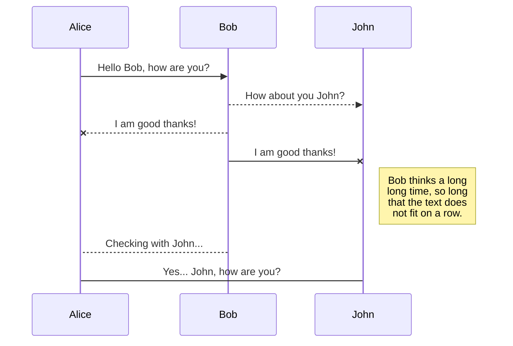
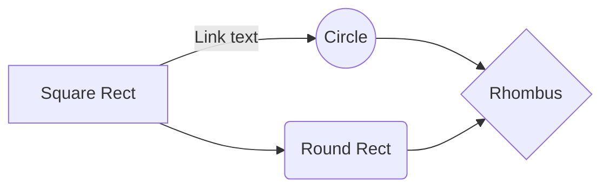

# Rosalind Bioinformatics Project

This repository is dedicated to my journey into the exciting world of bioinformatics. Here, I'll solve problems from [Rosalind](https://rosalind.info/), a platform offering algorithmic challenges in bioinformatics.

https://stackedit.io/app#

# Getting started

1. Clone this repository:

>git clone https://github.com/BioDani/Rosalind_project.git

2. Navigate to the directory:

>cd Rosalind_project

3. Create an virtual enviroment using conda

> conda create -n rosalind_env python=3.9

4. Export env to requirements.txt file

> conda env export > requirements.txt

5. Pull changes from a remote repository. Select origin brach and then destiny branch

> git pull rama_origen rama_destino

## Subtitulo

Texto y **negrita** 

## Frase de alguien

> asas as  a sas  as a s a

## Enlaces

[Nombre del enlace a creador de readme](https://stackedit.io/app#)

## Listas

- cosa 1
- cosa 2

## Tabla

|                |ASCII                          |HTML                         |
|----------------|-------------------------------|-----------------------------|
|Single backticks|`'Isn't this fun?'`            |'Isn't this fun?'            |
|Quotes          |`"Isn't this fun?"`            |"Isn't this fun?"            |
|Dashes          |`-- is en-dash, --- is em-dash`|-- is en-dash, --- is em-dash|

## KaTeX

You can render LaTeX mathematical expressions using [KaTeX](https://khan.github.io/KaTeX/):

The *Gamma function* satisfying $\Gamma(n) = (n-1)!\quad\forall n\in\mathbb N$ is via the Euler integral

$$
\Gamma(z) = \int_0^\infty t^{z-1}e^{-t}dt\,.
$$

> You can find more information about **LaTeX** mathematical expressions [here](http://meta.math.stackexchange.com/questions/5020/mathjax-basic-tutorial-and-quick-reference).

## UML diagrams

You can render UML diagrams using [Mermaid](https://mermaidjs.github.io/). For example, this will produce a sequence diagram:

And this will produce a flow chart:

